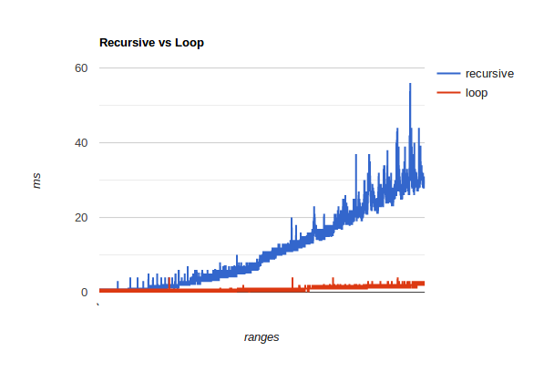

**Calculating prime numbers in a range**

*Note: I wrote this in Intellij using a Scala worksheet.*

This is part 2 of the tail recursion blog series.

I want to find out how a tailrec method compares to a 'ordinary' loop styled method.
In order to do that, the factorial needs to be replaced with something thats easier to scale.

Finding prime numbers in a range seems like a simple, scalable problem.

***Loop***

```scala
def loopPrimes(number: Int): List[Int] = {
	val primes = mutable.ArrayBuffer.empty[Int]

	(2 to number).foreach { number =>
		if (isPrime(number, primes)) primes.append(number)
	}
	primes.toList
}

def isPrime(currentNumber: Int, primes: mutable.ArrayBuffer[Int]): Boolean = {
	var isPrime = true
	var i = 0

	while (isPrime && i < primes.length) {
		if (currentNumber % primes(i) == 0) isPrime = false
		i += 1
	}
	isPrime
}
```

My solution utilize 2 loops. lets inspect them quickly.

loopPrimes
1. Initiate an empty mutable collection to hold prime numbers

2. loop over the range of possible primes, when a match occurs add it to the collection

3. return the list

isPrime
1. assume we have a prime number

2. compare the assumed prime to the other prime numbers

3. if the assumed prime is divisible by any of the other primes, its not a prime number.

4. return the boolean.

2 loops means 2 tailrec methods.

***Tail recursion***
```scala
def recPrimes(number: Int): List[Int] = {
	@tailrec
	def helper(n: Int, primes: List[Int] = List.empty): List[Int] =
		if (n >= number) primes
		else helper(n + 1, recFindPrime(n + 1, primes))

	helper(1)
}

def recFindPrime(maybePrime: Int, allPrimes: List[Int]): List[Int] = {
	@tailrec
	def helper(primes: List[Int]): List[Int] = primes match {
		case Nil => allPrimes ++ List(maybePrime)
		case _ if maybePrime % primes.head == 0 => allPrimes
		case _ :: tail => helper(tail)
	}

	helper(allPrimes)
}
```

recPrimes
1. setup a helper method, as we need to go from 1 up until 'number'.

2. if 'current' is large than 'number' we have found all prime numbers in the range.

3. otherwise continue the recursion with the next number ('current + 1') and the list of primes

recIsPrime
1. setup a helper method to exclude redundant parameter.

2. When there are no more elements left to compare (Nil), maybePrime is a prime number.

3. if the maybePrime is divisible by the first element in the list, it's not a prime number.

4. If none of the above matched, continue with the rest of the list (everything but the head) until it does.


***Comparing the algorithms***

It's interesting to see what happens on increasing ranges. That way we get a sense of the derivate of each function.

So I looped over the algorithms, to calculate for each iteration (1,2,3.. 10000). The result was staggering.


